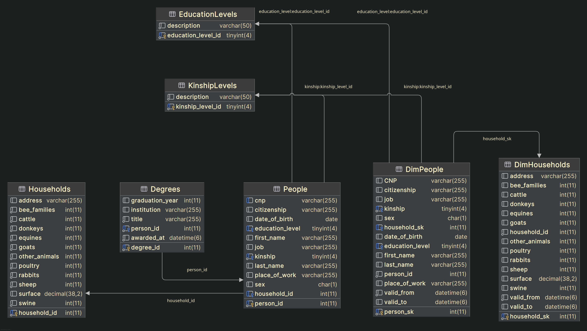

# GTManager
### Deliu Marius

## Descriere
Se solicita un sistem de management al datelor a mai multor gospodarii taranesti si a persoanelor member din ele, cu posibilitatea de a observa cum datele au fost modificate in timp.

## Obiective

* stocarea datelor personale despre persoane
* stocarea datelor despre gospodarii (suprafata, bunuri, etc.)
* salvarea datelor precedente in urma modificarilor
* implementarea conturilor de utilizatori

### To do / fix:
* adaugarea barelor de cautare
* diplomele nu trebuie sa poata fi acordate in viitor
* data acordarii diplomelor nu trebuie sa fie cea la care au fost adaugate in baza de date
* adaugarea unui sistem de logare
* ID-urile in tabelele temporale pot arata catre gospodarii sau oameni inexistenti
* starea diplomelor nu poate fi vizualizata in inregistrari din trecut
* pentru clasele de servicii, ar fi bine ca exceptiile sa fie tratate intr-un singur loc, nu in fiecare metoda
* CNP-urile persoanelor trebuie sa fie unice

* entitatile pentru date istorice pot (posibil) mosteni entitatile pentru date curente
* este posibila abstractizarea controllerelor la un singur model
* implementarea propriilor clase de exceptii

## Arhitectura
Aplicatia foloseste arhitectura MVCS (Model-View-Controller-Service).

### Baza de date
Baza de date este un container Docker de MariaDB, cu un user si o parola specificate si la care aplicatia se conecteaza cu ajutorul driverului JDBC.

### Model
Tabelele de date sunt create cu ajutorul standardelor Jakarta EE si conflictele de numire intre tabele sunt rezolvate de Hibernate.

### Repositories
Repozitoarele extind interfata Repository din JPA si implementeaza metodele CRUD pentru fiecare tabel din baza de date in mod automat. Metode cu query-uri speciale sunt implementate cu ajutorul mecanismului Spring Data JPA.

### Services
Serviciile folosesc repozitoriile pentru a efectua operatii CRUD asupra bazei de date, dar si pentru operatii mai complexe. Transmiterea datelor se face prin intermediul obiectelor DTO.

### Controleri
Controlerii sunt responsabili pentru a gestiona cererile HTTP. Solicita date de la servicii, le impacheteaza corespunzator si le transmite la view-uri.

### View
Pagini simple HTML decorate cu CSS. Datele solicitate sunt injectate cu Thymeleaf.

### Schema bazei de date

## Functionalitati/Exemple utilizare
\-

### Resurse
\-