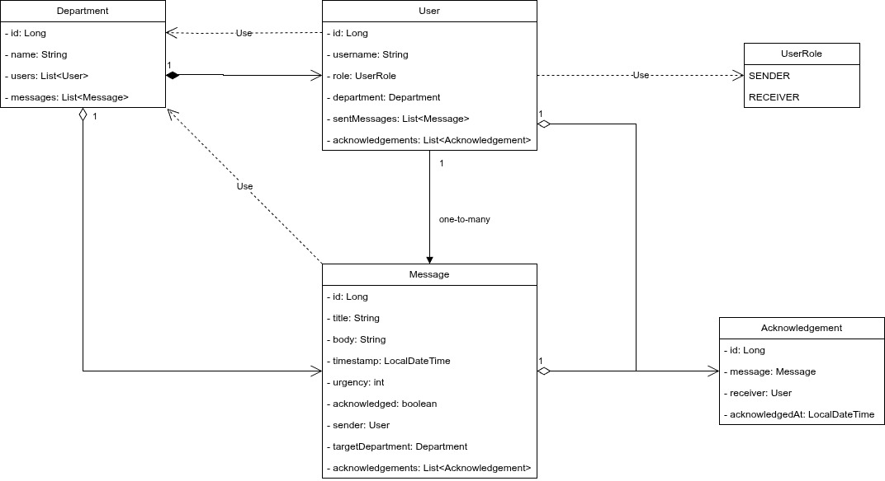

# PageMe
### Deliu Marius

## Descriere
Se solicita un sistem de paginare al membrilor unei organizatii cu orice fel de notificari din partea oricarui tip de persoane pentru orice motiv.

## Obiective

* roluri utilizatori
    - Sender (HR, Manager, etc.)
    - Receiver (Employees)
* trimiterea mesajelor
    - titlu
    - corp
    - urgenta (1 - 10)
* primirea si afisarea instantanee a alertelor
* istoric notificari
* departamente & grupuri

### Optionale
* recunoasterea mesajelor de catre utilizatori
    - utilizatorul apasa "OK"
* delivery status
    - sent
    - delivered
    - read
* programarea mesajelor in timp
* atasamente

## Arhitectura
Acesta este un WIP!

### Diagrama claselor


### Schema bazei de date
```
CREATE TABLE Departments (
    id INTEGER PRIMARY KEY AUTOINCREMENT,
    name TEXT NOT NULL UNIQUE
);

CREATE TABLE Users (
    id INTEGER PRIMARY KEY AUTOINCREMENT,
    username TEXT NOT NULL UNIQUE,
    role TEXT CHECK(role IN ('SENDER', 'RECEIVER')) NOT NULL,
    department_id INTEGER,
    FOREIGN KEY (department_id) REFERENCES Departments(id) ON DELETE SET NULL
);

CREATE TABLE Messages (
    id INTEGER PRIMARY KEY AUTOINCREMENT,
    title TEXT NOT NULL,
    body TEXT NOT NULL,
    timestamp DATETIME DEFAULT CURRENT_TIMESTAMP,
    urgency INTEGER CHECK(urgency BETWEEN 1 AND 10) NOT NULL,
    sender_id INTEGER NOT NULL,
    target_department_id INTEGER,
    acknowledged BOOLEAN DEFAULT 0,
    FOREIGN KEY (sender_id) REFERENCES Users(id) ON DELETE CASCADE,
    FOREIGN KEY (target_department_id) REFERENCES Departments(id) ON DELETE SET NULL
);

CREATE TABLE Acknowledgements (
    id INTEGER PRIMARY KEY AUTOINCREMENT,
    message_id INTEGER NOT NULL,
    receiver_id INTEGER NOT NULL,
    acknowledged_at DATETIME DEFAULT CURRENT_TIMESTAMP,
    FOREIGN KEY (message_id) REFERENCES Messages(id) ON DELETE CASCADE,
    FOREIGN KEY (receiver_id) REFERENCES Users(id) ON DELETE CASCADE,
    UNIQUE (message_id, receiver_id)
);
```

## Functionalitati/Exemple utilizare
\-

### Resurse
\-